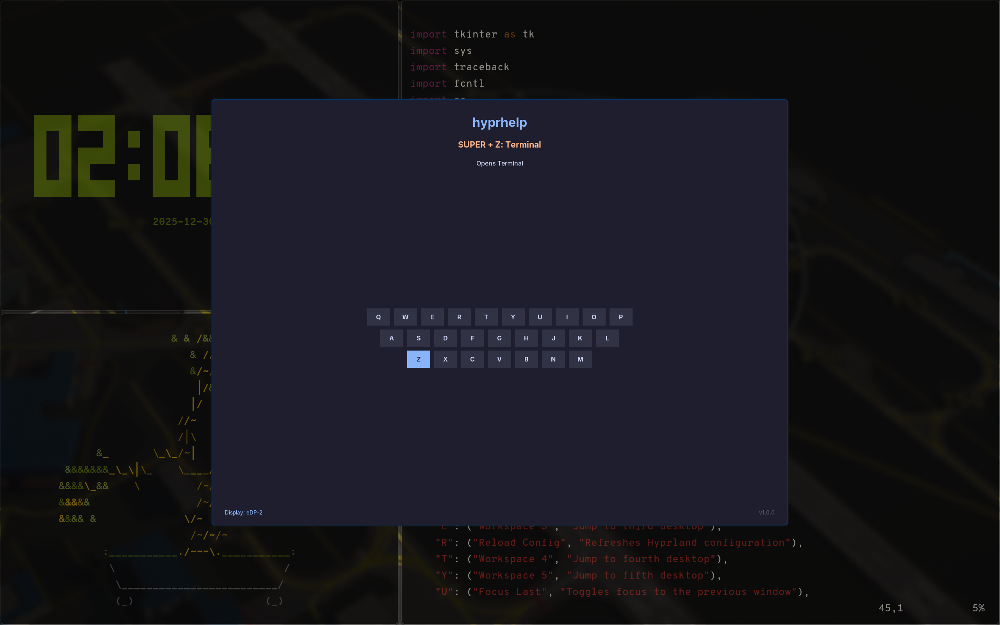

# hyprhelp

A lightweight, dependency-free cheatsheet overlay for Hyprland keybinds.



`hyprhelp` parses your `hyprland.conf` to generate a visual reference for your keybindings. It features a "dim-around" effect, interactive locking, auto-detection of your modifier key, and zero-latency startup using standard Python libraries.

## Prerequisites

You likely already have most of these, but ensure the following are installed:

* **Hyprland** (Tested on v0.40+)
* **Python 3**
* **Tkinter** (Standard Python GUI library)

```bash
# Arch Linux
sudo pacman -S tk

# Fedora
sudo dnf install python3-tkinter

# Debian/Ubuntu
sudo apt install python3-tk
```

## Installation

Clone the repository (or download the script manually):
```bash
git clone https://github.com/Yosh145/HyprHelp.git ~/.config/hypr/scripts/hyprhelp
```

Make the script executable:

```bash
chmod +x ~/.config/hypr/scripts/hyprhelp/hyprhelp.py
```

## Configuration

### 1. Window Rules

To make hyprhelp float, center, and look sharp, add these specific rules to your `~/.config/hypr/hyprland.conf`.

```conf
windowrulev2 = float, title:^(hyprhelp)$
windowrulev2 = center, title:^(hyprhelp)$
windowrulev2 = size 600 500, title:^(hyprhelp)$
windowrulev2 = dimaround, title:^(hyprhelp)$
windowrulev2 = stayfocused, title:^(hyprhelp)$
```

### 2. Fix XWayland Scaling (IMPORTANT)

> [!IMPORTANT]  
> Since this app uses Tkinter (which runs via XWayland), it may look blurry on high-DPI displays unless you disable scaling for XWayland apps.

Add this near the top of your config:

```conf
xwayland {
  force_zero_scaling = true
}
```

### 3. Add the Keybinding

Bind the script to a key (i.e., Super + H).

> [!NOTE]  
> Explicitly set `GDK_BACKEND=x11` to ensure maximum compatibility.

```conf
bind = $mainMod, H, exec, env GDK_BACKEND=x11 ~/.config/hypr/scripts/hyprhelp/hyprhelp.py
```

## Dynamic Usage (Recommended)

As of **v1.1.0**, `hyprhelp` automatically reads your `hyprland.conf` file to generate the cheatsheet. You define the **Title** and **Description** directly in your config file using comments.

### Syntax

Add a comment to the end of your bind line in this format:
`# [Title] Description`

### Example `hyprland.conf`:

```ini
$mainMod = SUPER

# Define a title inside brackets, followed by the description
bind = $mainMod, Q, exec, kitty # [Terminal] Launch the terminal
bind = $mainMod, C, killactive, # [Close] Kill the active window
bind = $mainMod, F, fullscreen, # [Fullscreen] Toggle fullscreen mode

# You can also bind arrows!
bind = $mainMod, Up, movewindow, u # [Move Up] Move window up

```

**Reload Hyprland** (`hyprctl reload`) and launch the tool. Your binds will appear automatically.

## Manual Configuration (Fallback)

If `hyprhelp` cannot find your config file, or if you prefer to hardcode your cheatsheet, you can edit the `DEFAULT_KEY_MAP` dictionary inside `hyprhelp.py`.

Open `hyprhelp.py` and edit the dictionary at the top:

```python
KEY_MAP = {
    "Q": ("Workspace 1", "Jump to your first desktop"),
    "W": ("My Custom App", "Launches my special script"),
    # ...
}
```

### Sample Empty Keybinds

```python
KEY_MAP = {
    # -- Row 1 (Numbers) --
    "1": ("Workspace 1", ""),
    "2": ("Workspace 2", ""),
    "3": ("Workspace 3", ""),
    "4": ("Workspace 4", ""),
    "5": ("Workspace 5", ""),
    "6": ("Workspace 6", ""),
    "7": ("Workspace 7", ""),
    "8": ("Workspace 8", ""),
    "9": ("Workspace 9", ""),
    "0": ("Workspace 10", ""),

    # -- Row 2 --
    "Q": ("", ""),
    "W": ("", ""),
    "E": ("", ""),
    "R": ("", ""),
    "T": ("", ""),
    "Y": ("", ""),
    "U": ("", ""),
    "I": ("", ""),
    "O": ("", ""),
    "P": ("", ""),
    
    # -- Row 3 --
    "A": ("", ""),
    "S": ("", ""),
    "D": ("", ""),
    "F": ("", ""),
    "G": ("", ""),
    "H": ("", ""),
    "J": ("", ""),
    "K": ("", ""),
    "L": ("", ""),
    
    # -- Row 4 --
    "Z": ("", ""),
    "X": ("", ""),
    "C": ("", ""),
    "V": ("", ""),
    "B": ("", ""),
    "N": ("", ""),
    "M": ("", ""),

    # -- Function Keys --
    "F1": ("", ""),
    "F2": ("", ""),
    "F3": ("", ""),
    "F4": ("", ""),
    "F5": ("", ""),
    "F6": ("", ""),
    "F7": ("", ""),
    "F8": ("", ""),
    "F9": ("", ""),
    "F10": ("", ""),
    "F11": ("", ""),
    "F12": ("", ""),

    # -- Arrow Keys (Unicode symbols) --
    "↑": ("Up", ""),
    "↓": ("Down", ""),
    "←": ("Left", ""),
    "→": ("Right", ""),
}
```

## Troubleshooting

### The window is blurry / text is huge:

Ensure you added `xwayland { force_zero_scaling = true }` to your `hyprland.conf`.

### The window doesn't appear:

Run the script manually in your terminal to check for errors:

```bash
env GDK_BACKEND=x11 ~/.config/hypr/scripts/hyprhelp/hyprhelp.py
```

*If it crashes with `ModuleNotFoundError`, you are missing the `tkinter` package (see Prerequisites).*

### My binds aren't showing up:

1. Ensure your config comments follow the format `# [Title] Description`.
2. Ensure you are using the variable `$mainMod` or the string `SUPER` in your bind definition.

## License
MIT License (Do whatever you want with it).